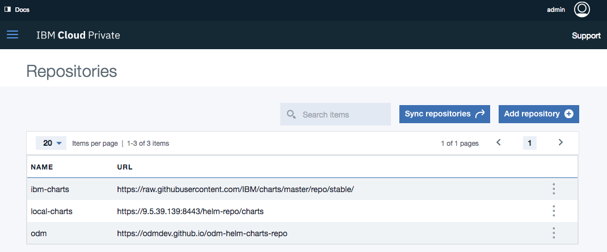
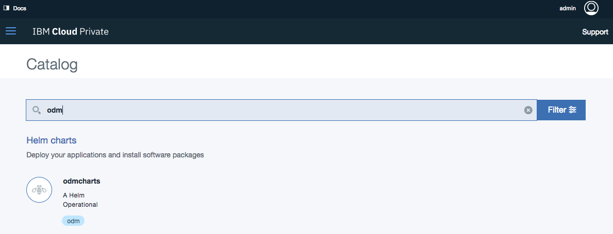
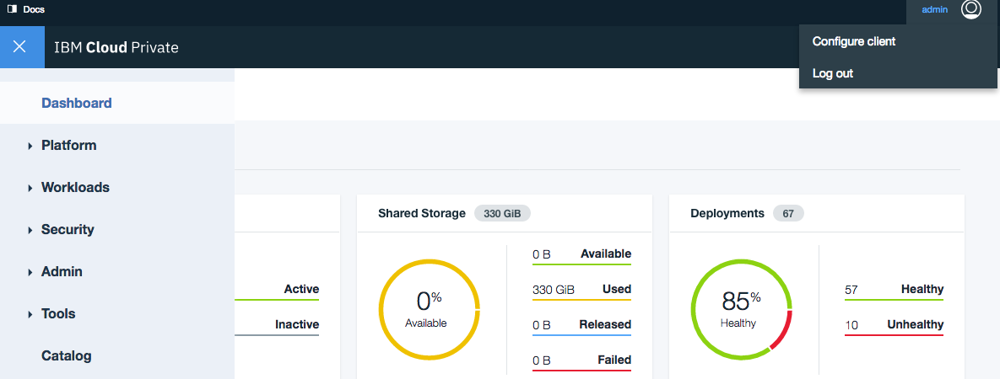

#  Deploying IBM Operational Decision Manager Standard on IBM Private cloud

This tutorial explains the deployment of an IBM® Operational Decision Manager clustered topology on IBM Cloud private, based on the Kubernetes technology.

ODM Docker material is used here, which is available in the [odm-ondocker](https://github.com/ODMDev/odm-ondocker) repository. It includes Docker files and Docker Compose descriptors. ODM containers are based on IBM WebSphere® Application Server Liberty. In this tutorial, only the Docker files are used to build ODM runtime images that will be instantiated in the Kubernetes cluster.


## Included Components
- [IBM ODM](https://www.ibm.com/support/knowledgecenter/SSQP76_8.9.0/welcome/kc_welcome_odmV.html)
- [IBM Private Cloud](https://www.ibm.com/cloud-computing/products/ibm-cloud-private/)
- [Docker-compose](https://docs.docker.com/compose/)

## Test environment
This tutorial was tested on MacOS.

## Prerequisites

* Install a Git client to obtain the sample code.
* Install a [Docker](https://docs.docker.com/engine/installation/) engine.
* [Docker-compose](https://docs.docker.com/compose/) tool.

## Steps

1. [Installing and configuring IBM Cloud private](#1-installing-and-configuring-ibm-cloud-private)
2. [Getting the ODM Docker material](#2-getting-the-odm-docker-material)
3. [Tagging and deploying the ODM Docker material in the IBM Cloud private Docker registry](#3-tagging-and-deploying-the-odm-docker-material-in-the-ibm-cloud-private-docker-registry)
4. [Deploying an ODM topology with the admin console](#4-deploying-an-odm-topology-with-the-admin-console)
5. [Deploying an ODM topology with the Helm command line tool](#5-deploying-an-odm-topology-with-the-helm-command-line-tool)


# 1. Installing and configuring IBM Cloud private


Install [IBM Cloud private](https://www.ibm.com/support/knowledgecenter/en/SSBS6K_1.2.0/installing/installing.html).


You can interact with the admin console when IBM Cloud private is installed.


# 2. Getting the ODM Docker material

* Go to the ODM installation directory and clone the ODM docker repository.
```bash
      cd <ODM_INSTALLATION>
      git clone https://github.com/ODMDev/odm-ondocker
      cp odm-ondocker/src/main/resources/.dockerignore ./
      docker-compose build
  ```

# 3. Tagging and deploying the ODM Docker material in the IBM Cloud private Docker registry

The [IBM Cloud private Docker registry] is used in this use case.

```bash
    docker login mycluster.icp:8500 (username/password)  -> admin/admin by default.

    docker tag ibmcom/dbserver:8.9.0 mycluster.icp:8500/ibmcom/dbserver:8.9.0
    docker push mycluster.icp:8500/ibmcom/dbserver:8.9.0

    docker tag ibmcom/odm-decisionserverconsole:8.9.0 mycluster.icp:8500/ibmcom/odm-decisionserverconsole:8.9.0
    docker push  mycluster.icp:8500/ibmcom/odm-decisionserverconsole:8.9.0

    docker tag ibmcom/odm-decisionrunner:8.9.0  mycluster.icp:8500/ibmcom/odm-decisionrunner:8.9.0
    docker push  mycluster.icp:8500/ibmcom/odm-decisionrunner:8.9.0

    docker tag ibmcom/odm-decisionserverruntime:8.9.0 mycluster.icp:8500/ibmcom/odm-decisionserverruntime:8.9.0
    docker push mycluster.icp:8500/ibmcom/odm-decisionserverruntime:8.9.0

    docker tag ibmcom/odm-decisioncenter:8.9.0 mycluster.icp:8500/ibmcom/odm-decisioncenter:8.9.0
    docker push mycluster.icp:8500/ibmcom/odm-decisioncenter:8.9.0
  ```


For more information, see [Working with your IBM Cloud private Docker registry](https://www.ibm.com/developerworks/community/blogs/fe25b4ef-ea6a-4d86-a629-6f87ccf4649e/entry/Working_with_the_local_docker_registry_from_Spectrum_Conductor_for_Containers?lang=en)

# 4. Deploying an ODM topology with the admin console
  - Log on to the IBM Cloud private console.
  - Click the menu next to **IBM Cloud Private** and go to **Admin** > **Repositories**. 
  - Click **Add Repository**
 
  - In the Add repository window, enter the following values and click **Add**:
    - Name: odmcharts
    - URL :  https://odmdev.github.io/odm-helm-charts-repo/

  - Click the menu and go to **Catalog**. You can see the ODM chart (`odmcharts`) in the package list.

  - Click `odmcharts`.
  - Click **Configure** and enter values for the parameters. For more information about the ODM charts parameters, see the Helm [README](../helm/stable/odmcharts/README.md) file.
  - Click **Install**. The Installation complete window is displayed.
https://odmdev.github.io/odm-helm-charts-repo/

# 5. Deploying an ODM topology with the Helm command line tool

# 5.1. Interacting with your cluster

You must set environment variables to interact with kubectl and Helm tools.

  - Click the menu and go to **Dashboard**. Click the user name in the uppper right corner in the IBM Cloud private console, and then select **Configure client**.



  - Open a command line, and follow the instructions in the topic [Accessing your IBM Cloud private cluster by using the kubectl CLI](https://www.ibm.com/support/knowledgecenter/en/SSBS6K_1.2.0/manage_cluster/cfc_cli.html) in IBM Knowledge Center.

For more information about installating the Helm tool, see [].

# 5.2 Verifying the secret of the registry

You verify that the secret of the registry is available.

For more information, see [Identifying the imagePullSecrets value for your namespace](
https://www.ibm.com/support/knowledgecenter/en/SSBS6K_2.1.0/manage_images/imagepullsecret.html) in IBM Knowledge Center.

Run the following command to see your private key:
```bash
  kubect get secrets
 ```   
If you do not see it, create a new one:
```bash
  kubectl create secret docker-registry  admin.registrykey --docker-server=mycluster.icp:8500 --docker-username=admin --docker-password=admin --docker-email=laurent.grateau@fr.ibm.com
 ```   

# 5.3 Deploying the ODM Helm chart:
```bash
	cd IBM-ODM-Kubernetes/IBMCloudPrivate
	helm install  odmcharts --set image.pullSecrets=admin.registrykey --set image.repository=mycluster.icp:8500/ibmcom
 ```

To install the Helm client, follow the instructions in [Installing Helm](https://github.com/kubernetes/helm/blob/master/docs/install.md).
```bash
NAME:   snug-dog
LAST DEPLOYED: Sun Sep 17 11:10:33 2017
NAMESPACE: default
STATUS: DEPLOYED

RESOURCES:
==> v1/Service
NAME                       CLUSTER-IP  EXTERNAL-IP  PORT(S)         AGE
odm-decisionserverconsole  10.0.0.93   <nodes>      9080:30686/TCP  1s
odm-decisionrunner         10.0.0.137  <nodes>      9080:30533/TCP  1s
odm-decisioncenter         10.0.0.102  <nodes>      9060:31040/TCP  1s
dbserver                   10.0.0.99   <nodes>      1527:32359/TCP  1s
odm-decisionserverruntime  10.0.0.154  <nodes>      9080:32072/TCP  1s

==> v1beta1/Deployment
NAME                       DESIRED  CURRENT  UP-TO-DATE  AVAILABLE  AGE
odm-decisionserverruntime  2        2        2           0          1s
odm-decisionrunner         1        1        1           0          1s
dbserver                   1        1        1           0          1s
odm-decisioncenter         1        1        1           0          1s
odm-decisionserverconsole  1        1        1           0          1s


NOTES:
Thank you for installing odmcharts.
  ```
For more information about this template, see the following github: https://github.com/ODMDev/odm-docker-kubernetes.

# Other information

Username/Password :
  - Decision Cener Business console : rtsAdmin/rtsAdmin
  - Rule Execution Server : resAdmin/resAdmin
  - Decision Runner: resDeployer/resDeployer

Get the application URL by running the following commands:

- Decision Center / Business console
  ```
  export NODE_PORT_DC=$(kubectl get --namespace default -o jsonpath="{.spec.ports[0].nodePort}" services odm-decisioncenter)
  export NODE_IP=$(kubectl get nodes --namespace default -o jsonpath="{.items[0].status.addresses[0].address}")
  ```
  
  - Decision Center / Business console
    ```
    echo http://$NODE_IP:$NODE_PORT_DC/decisioncenter
    ```
  
  - Team Server
    ```
    echo http://$NODE_IP:$NODE_PORT_DC/teamserver
    ```
  
- Testing and simulation
  ```
  export NODE_PORT_DR=$(kubectl get --namespace default -o jsonpath="{.spec.ports[0].nodePort}" services odm-decisionrunner)
  export NODE_IP=$(kubectl get nodes --namespace default -o jsonpath="{.items[0].status.addresses[0].address}")
  ```
  
  - Decision Runner
    ```
    echo http://$NODE_IP:$NODE_PORT_DR/DecisionRunner
    ```

- Decision Service console (Rule Execution Server console)
  ```
  export NODE_PORT_DSC=$(kubectl get --namespace default -o jsonpath="{.spec.ports[0].nodePort}" services odm-decisionserverconsole)
  export NODE_IP=$(kubectl get nodes --namespace default -o jsonpath="{.items[0].status.addresses[0].address}")
  ```
  
  - Decision Service console (Rule Execution Server console)
    ```
    echo http://$NODE_IP:$NODE_PORT_DSC/res
    ```
  
- Decision Service runtime (HTDS)
  ```
  export NODE_PORT_DSC=$(kubectl get --namespace default -o jsonpath="{.spec.ports[0].nodePort}" services odm-decisionserverruntime)
  export NODE_IP=$(kubectl get nodes --namespace default -o jsonpath="{.items[0].status.addresses[0].address}")
  ```
  
  - Decision Service runtime
    ```
    echo http://$NODE_IP:$NODE_PORT_DSC/DecisionService
    ```

Your release is named `snug-dog`.

To learn more about the release, use the following commands:
  ```
  $ helm status snug-dog
  $ helm get snug-dog
  ```


# License
[Apache 2.0](LICENSE)
