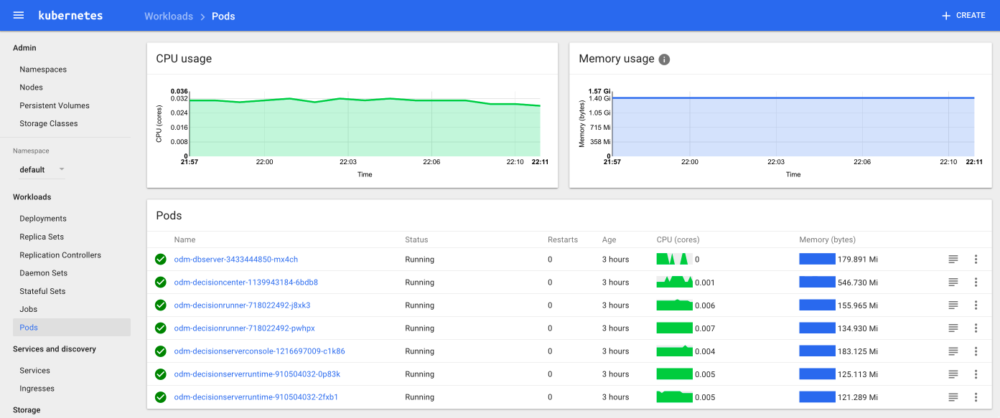

# Deploy IBM Operational Decision Manager Standard on Google Cloud Container Engine

This project demonstrates the deployment of an IBM Operational Decision Manager clustered topology using WAS Liberty on Google Cloud. For this we leverage Kubernetes and Docker technologies made available by Google through Google Container Registry and Engine.

We reuse the ODM Docker material put available on this repository [odm-ondocker](https://github.com/lgrateau/odm-ondocker). It includes Docker files and Docker compose descriptors. In this tutorial we will only use the Docker files to build the ODM runtime images that we will instantiate in the Kubernetes cluster.


## Included Components
- [IBM ODM](https://www.ibm.com/support/knowledgecenter/SSQP76_8.9.0/welcome/kc_welcome_odmV.html)
- [Google Container Engine](...)
- [Google Container Registry](...)

## Testing
This tutorial has been tested on MacOS.

## Prerequisite

* Create a Kubernetes cluster in Google Container Engine [Google Container Engine](...).
* Install a Git client to obtain the sample code.
* Install a [Docker](https://docs.docker.com/engine/installation/) engine.

## Deploy to Kubernetes Cluster from Google Container

## Steps

1. [Install Docker CLI and Google Cloud CLI](#1-install-docker-cli-and-google-cloud-cli)
2. [Get and build the application code](#2-get-and-build-the-application-code)
3. [Build application containers](#3-build-application-containers)
4. [Create Services and Deployments](#4-create-services-and-deployments)

# 1. Install Docker and Google Cloud CLI

First, install [Docker CLI](https://www.docker.com/community-edition#/download).

Then, install the Bluemix container registry plugin.

```bash
bx plugin install container-registry -r bluemix
```

Once the plugin is installed you can log into the Bluemix Container Registry.

```bash
bx cr login
```

If this is the first time using the Bluemix Container Registry you must set a namespace which identifies your private Bluemix images registry. It can be between 4 and 30 characters.

```bash
bx cr namespace-add <namespace>
```

Verify that it works.

```bash
bx cr images
```


# 2. Get and build the application code

* `git clone` the following projects:
   * [odm-ondocker](https://github.com/lgrateau/odm-ondocker)
   ```bash
      git clone https://github.com/lgrateau/odm-ondocker
  ```

# 3. Build application containers

Use the following commands to build the microservers containers.
Docker registry eu.gcr.io/odm890-kubernetes/ is used as an example. PLease replace it by your registry path.

Build the decision server container

```bash
docker tag odmdocker/decisionserverruntime:8.9.0 eu.gcr.io/odm890-kubernetes/ibm-odm-decisionserverruntime:8.9.0 
gcloud docker -- push eu.gcr.io/odm890-kubernetes/ibm-odm-decisionserverruntime:8.9.0
```

Build the Derby decision db server container

```bash
docker tag odmdocker/dbserver:8.9.0 eu.gcr.io/odm890-kubernetes/ibm-odm-dbserver:8.9.0 
gcloud docker -- push eu.gcr.io/odm890-kubernetes/ibm-odm-dbserver:8.9.0
```

Build the decision center container

```bash
docker tag odmdocker/decisioncenter:8.9.0 eu.gcr.io/odm890-kubernetes/ibm-odm-decisioncenter:8.9.0 
gcloud docker -- push eu.gcr.io/odm890-kubernetes/ibm-odm-decisioncenter:8.9.0
```

Build the decision server console runtime container

```bash
docker tag odmdocker/decisionserverconsole:8.9.0 eu.gcr.io/odm890-kubernetes/ibm-odm-decisionserverconsole:8.9.0 
gcloud docker -- push eu.gcr.io/odm890-kubernetes/ibm-odm-decisionserverconsole:8.9.0
```

Build the decision runner container

```bash
docker tag odmdocker/decisionrunner:8.9.0 eu.gcr.io/odm890-kubernetes/ibm-odm-decisionrunner:8.9.0 
gcloud docker -- push eu.gcr.io/odm890-kubernetes/ibm-odm-decisionrunner:8.9.0
```

# 4. Create Services and Deployments

Change the image name given in the respective deployment YAML files for  all the projects in the manifests directory with the newly build image names.

Get the public ip of the node

```bash
$ kubectl get nodes
NAME             STATUS    AGE
169.47.241.106   Ready     23h
```
Set the value of `SOURCE_IP` env variable present in deploy-nginx.yaml file present in manifests folder with the public ip of the node.

Deploy the microservice from the manifests directory with the command `kubectl create -f <filename>` or run the following commands:

```bash
kubectl create -f odm-standard-gcloud.yaml
```

After you have created all the services and deployments, wait for 5 to 10 minutes. You can check the status of your deployment on Kubernetes UI. Run 'kubectl proxy' and go to URL 'http://127.0.0.1:8001/ui' to check when the application containers are ready.


After few minutes the following commands to get your public IP and NodePort number.

```bash
$ kubectl get nodes
NAME             STATUS    AGE
169.47.241.106   Ready     23h
$ kubectl get svc nginx-svc
NAME        CLUSTER-IP     EXTERNAL-IP   PORT(S)        AGE
nginx-svc   10.10.10.167   <nodes>       80:30056/TCP   11s
```




When you click on speaker name


## Troubleshooting

* If your microservice instance is not running properly, you may check the logs using
	* `kubectl logs <your-pod-name>`
* To delete a microservice
	* `kubectl delete -f manifests/<microservice-yaml-file>`
* To delete everything
	* `kubectl delete -f manifests`


## References

# License
[Apache 2.0](LICENSE)

