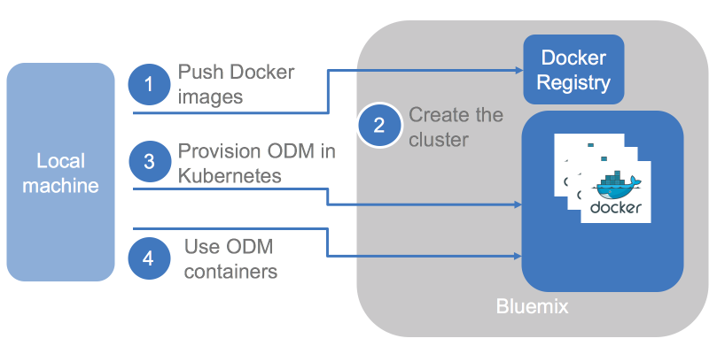

# Deploy IBM Operational Decision Manager Standard on Google Cloud Container Engine

This project demonstrates the deployment of an IBM Operational Decision Manager clustered topology using WAS Liberty on Google Cloud. For this we leverage Kubernetes and Docker technologies made available by Google through Google Container Registry and Engine.

We reuse the ODM Docker material put available on this repository [odm-ondocker](https://github.com/lgrateau/odm-ondocker). It includes Docker files and Docker compose descriptors. In this tutorial we will only use the Docker files to build the ODM runtime images that we will instantiate in the Kubernetes cluster.



## Included Components
- [IBM ODM](https://www.ibm.com/support/knowledgecenter/SSQP76_8.9.0/welcome/kc_welcome_odmV.html)
- [Google Container Engine](...)
- [Google Container Registry](...)

## Testing
This tutorial has been tested on MacOS.

## Prerequisite

* Create a Kubernetes cluster in Google Container Engine [Google Container Engine](...).
* Install a Git client to obtain the sample code.
* Install a [Docker](https://docs.docker.com/engine/installation/) engine.

## Deploy to Kubernetes Cluster from Google Container

## Steps

1. [Install Docker CLI and Google Cloud CLI](#1-install-docker-cli-and-google-cloud-cli)
2. [Get and build the application code](#2-get-ODM-Docker-files-and-Kubernetes-manifest)
3. [Build application containers](#3-build-your-ODM-images)
4. [Create Services and Deployments](#4-create-services-and-deployments)

# 1. Install Docker and Google Cloud CLI

First, install [Docker CLI](https://www.docker.com/community-edition#/download).

Then, install the [Google Cloud CLI](https://cloud.google.com/sdk/docs/)

Once the Google Cloud CLI check your configuration.

```bash
gcloud info
```

# 2. Get ODM Docker files and Kubernetes manifest

* `git clone` the following projects:
   * [odm-ondocker](https://github.com/lgrateau/odm-ondocker)
   ```bash
      git clone https://github.com/lgrateau/odm-ondocker
  ```
   * [IBM-ODM-Kubernetes](https://github.com/PierreFeillet/IBM-ODM-Kubernetes)
   ```bash
      git clone https://https://github.com/PierreFeillet/IBM-ODM-Kubernetes
  ```

# 3. Build your ODM images

Docker registry eu.gcr.io/odm890-kubernetes/ is used as an example. PLease replace it by your registry path.

Build the decision server container

```bash
docker tag odmdocker/decisionserverruntime:8.9.0 eu.gcr.io/odm890-kubernetes/ibm-odm-decisionserverruntime:8.9.0 
gcloud docker -- push eu.gcr.io/odm890-kubernetes/ibm-odm-decisionserverruntime:8.9.0
```

Build the Derby decision db server container

```bash
docker tag odmdocker/dbserver:8.9.0 eu.gcr.io/odm890-kubernetes/ibm-odm-dbserver:8.9.0 
gcloud docker -- push eu.gcr.io/odm890-kubernetes/ibm-odm-dbserver:8.9.0
```

Build the decision center container

```bash
docker tag odmdocker/decisioncenter:8.9.0 eu.gcr.io/odm890-kubernetes/ibm-odm-decisioncenter:8.9.0 
gcloud docker -- push eu.gcr.io/odm890-kubernetes/ibm-odm-decisioncenter:8.9.0
```

Build the decision server console runtime container

```bash
docker tag odmdocker/decisionserverconsole:8.9.0 eu.gcr.io/odm890-kubernetes/ibm-odm-decisionserverconsole:8.9.0 
gcloud docker -- push eu.gcr.io/odm890-kubernetes/ibm-odm-decisionserverconsole:8.9.0
```

Build the decision runner container

```bash
docker tag odmdocker/decisionrunner:8.9.0 eu.gcr.io/odm890-kubernetes/ibm-odm-decisionrunner:8.9.0 
gcloud docker -- push eu.gcr.io/odm890-kubernetes/ibm-odm-decisionrunner:8.9.0
```

# 4. Create Services and Deployments

Edit the odm-standard-gcloud.yaml descriptor.
Change the image name given in the deployment YAML file with the newly build image names pushed in your Google Docker registry.

Then deploy the ODM topology with the following command:

```bash
kubectl create -f odm-standard-gcloud.yaml
```

After you have created all the services and deployments, wait for 5 to 10 minutes. You can check the status of your deployment on Kubernetes UI. Run 'kubectl proxy' and go to URL 'http://127.0.0.1:8001/ui' to check when the application containers are ready.


After few minutes the following commands to get your public IP and NodePort number.

```bash
$ kubectl get nodes
NAME                                               STATUS    AGE       VERSION
gke-ibm-odm-cluster-1-default-pool-b02d3eae-cswb   Ready     19h       v1.6.4
gke-ibm-odm-cluster-1-default-pool-b02d3eae-pvdr   Ready     19h       v1.6.4
gke-ibm-odm-cluster-1-default-pool-b02d3eae-rt52   Ready     19h       v1.6.4

$ $ kubectl get svc
NAME                        CLUSTER-IP      EXTERNAL-IP      PORT(S)          AGE
dbserver                    10.43.248.47    35.187.188.198   1527:32725/TCP   15h
kubernetes                  10.43.240.1     <none>           443/TCP          19h
odm-decisioncenter          10.43.240.151   35.187.41.88     9060:32434/TCP   15h
odm-decisionrunner          10.43.249.122   130.211.62.210   9070:31889/TCP   15h
odm-decisionserverconsole   10.43.245.253   35.187.110.53    9080:30589/TCP   15h
odm-decisionserverruntime   10.43.250.80    <nodes>          9080:32703/TCP   15h
```


When you click on speaker name


## Troubleshooting

* If your microservice instance is not running properly, you may check the logs using
	* `kubectl logs <your-pod-name>`
* To delete a microservice
	* `kubectl delete -f manifests/<microservice-yaml-file>`
* To delete everything
	* `kubectl delete -f manifests`


## References

# License
[Apache 2.0](LICENSE)

